---

# 💰 HỆ THỐNG QUẢN LÝ TÀI CHÍNH CÁ NHÂN (PERSONAL-EXPENSE-MANAGEMENT)

Dự án này là một ứng dụng giao diện dòng lệnh (CLI) giúp người dùng quản lý thu chi cá nhân một cách có hệ thống và chi tiết. Hệ thống giải quyết bài toán theo dõi dòng tiền, kiểm soát ngân sách và cung cấp cái nhìn tổng quan về tình hình tài chính thông qua các báo cáo trực quan mà không cần phụ thuộc vào hệ quản trị cơ sở dữ liệu bên ngoài.

Ứng dụng đặc biệt chú trọng vào việc xây dựng nền tảng khoa học máy tính vững chắc bằng cách tự triển khai các cấu trúc dữ liệu từ đầu như Bảng băm (HashMap) và Thuật toán tìm kiếm nhị phân (Binary Search) để tối ưu hóa hiệu suất truy xuất.

---

## 🚀 1. CÁC TÍNH NĂNG NỔI BẬT (FEATURES)

* **Quản lý Danh mục (Categories):** Hỗ trợ thêm mới, chỉnh sửa, và xóa mềm (soft delete) các danh mục thu/chi để bảo toàn tính toàn vẹn dữ liệu lịch sử.
* **Kiểm soát Ngân sách (Budgeting):** Cho phép thiết lập hạn mức chi tiêu cho từng danh mục và tự động phát cảnh báo khi giao dịch mới làm vượt ngân sách tháng.
* **Quản lý Giao dịch (Transactions):** Ghi nhận chi tiết số tiền, ngày tháng, danh mục và ghi chú; hỗ trợ tự động gợi ý danh mục dựa trên lịch sử ghi chú.
* **Hệ thống Báo cáo Đa dạng:** Trích xuất báo cáo tài chính theo ngày, tháng, năm, hoặc chu kỳ K tháng gần nhất kèm theo biểu đồ ASCII trực quan biểu diễn tỷ trọng chi tiêu.
* **Lưu trữ & Khôi phục Dữ liệu (I/O):** Serialize toàn bộ hệ thống object thành file text tùy chỉnh (`storage/data.txt`) và hỗ trợ tính năng Import giao dịch hàng loạt từ file CSV.
* **Tối ưu hóa Tra cứu:** Áp dụng thuật toán Binary Search để tra cứu giao dịch theo ngày và sử dụng Custom HashMap để quản lý trạng thái phân mục theo từng tháng.

---

## 🛠️ 2. CÔNG NGHỆ & THƯ VIỆN SỬ DỤNG (TECH STACK)

Dự án được phát triển thuần túy bằng Python tiêu chuẩn, không sử dụng các framework hay thư viện bên thứ ba nhằm tối đa hóa khả năng di động và tập trung vào kỹ năng thiết kế thuật toán cốt lõi.

| Công nghệ / Thư viện | Phiên bản | Mục đích / Chức năng trong dự án |
| --- | --- | --- |
| **Python** | v3.8+ | Xây dựng toàn bộ logic, cấu trúc dữ liệu và giao diện CLI. |
| **datetime** | Built-in | Xử lý, phân tích định dạng chuỗi ngày tháng và tính toán chu kỳ thời gian. |
| **csv** | Built-in | Đọc và bóc tách dữ liệu từ file đầu vào để import giao dịch hàng loạt. |

---

## 📂 3. CẤU TRÚC THƯ MỤC (DIRECTORY STRUCTURE)

Dự án được phân tách thành các module độc lập, đảm bảo tính đóng gói và dễ dàng bảo trì.

```text
├── core/
│   ├── data_structure.py    # Triển khai HashMap và HashNode từ đầu
│   └── models.py            # Chứa các lớp thực thể (Transaction, Category, ExpenseState...)
├── data/
│   ├── file_io.py           # Logic đọc/ghi file lưu trữ persistent custom format
│   └── index_services.py    # Các lớp chỉ mục (MonthIndex, TransactionIndex, CategoryIndex)
├── services/
│   ├── category_manager.py  # Xử lý nghiệp vụ liên quan đến danh mục
│   ├── transaction_manager.py# Xử lý nghiệp vụ giao dịch, kiểm tra ngân sách, gợi ý
│   └── report_manager.py    # Tổng hợp số liệu và render giao diện báo cáo ASCII
├── storage/                 # Thư mục chứa dữ liệu sinh ra trong quá trình chạy
│   ├── data.txt             # File CSDL chính của hệ thống
│   └── inputoutput.txt      # File log ghi lại lịch sử thao tác của người dùng
└── main.py                  # Điểm neo khởi chạy ứng dụng CLI, chứa cấu trúc Menu

```

---

## ⚙️ 4. HƯỚNG DẪN CÀI ĐẶT & KHỞI CHẠY (INSTALLATION & SETUP)

**Yêu cầu hệ thống trước khi cài đặt:**

* Hệ điều hành: Windows, macOS, hoặc Linux.
* Môi trường: Python 3.8 trở lên.

**Các bước cài đặt chi tiết:**

1. **Clone repository về máy local:**
```bash
git clone https://github.com/your-username/Personal-Expense-Management.git
cd Personal-Expense-Management

```


2. **Khởi tạo cấu trúc lưu trữ:**
Đảm bảo rằng thư mục `storage` đã tồn tại trong thư mục gốc của dự án để hệ thống có thể ghi file dữ liệu.
```bash
mkdir storage

```


3. **Khởi chạy ứng dụng:**
Dự án không yêu cầu cài đặt gói phụ thuộc qua pip do sử dụng 100% thư viện chuẩn. Bạn chỉ cần chạy file chính:
```bash
python main.py

```


---

## 🧪 5. HƯỚNG DẪN SỬ DỤNG & DEMO (USAGE)

Sau khi khởi chạy `main.py`, hệ thống sẽ hiển thị **MENU CHÍNH** trên terminal với số dư hiện tại. Người dùng tương tác bằng cách nhập các phím số tương ứng.

**Ví dụ: Thêm một giao dịch mới**
Từ Menu Chính, chọn `2` (Quản lý Giao dịch), sau đó chọn `1` (Thêm giao dịch).

```text
  -- THÊM GIAO DỊCH --
  Số tiền (đ)      : 150000
  Ngày (dd-mm-yyyy): 18-06-2026
  Ghi chú          : An trua cung nhom
  -- Danh sách Danh mục hiện có --
   - An uong (expense)
   - Luong (income)
  Chọn danh mục (Nhập Tên): An uong
  KẾT QUẢ: Thêm giao dịch thanh cong. (ID=TX20260618175200, So tien=150,000d, Ngay=18-06-2026)

```

Tất cả các thao tác (Prompt và Input) đều được hệ thống tự động ghi log vào file `storage/inputoutput.txt` để hỗ trợ quá trình gỡ lỗi.

---

## 🗺️ 6. KIẾN TRÚC HỆ THỐNG & SƠ ĐỒ LỚP (ARCHITECTURE & OOP CLASS DIAGRAMS)

Hệ thống được thiết kế theo mô hình hướng đối tượng phân lớp (Layered Architecture), tách biệt rõ ràng giữa cấu trúc dữ liệu cốt lõi, thực thể lưu trữ, dịch vụ chỉ mục tối ưu và tầng quản lý nghiệp vụ.

### 📊 Sơ đồ lớp tự động hiển thị trên GitHub (Mermaid)

```mermaid
classDiagram
    %% Core & Data Structures
    class HashNode {
        +key: String
        +value: Object
        +next: HashNode
        +HashNode(key: String, value: Object)
    }

    class HashMap {
        -TABLE_SIZE: int
        -buckets: List
        -count: int
        #_pure_insert(key: String, value: Object) void
        +insert(key: String, value: Object) void
        +get(key: String) Object
        +contains_key(key: String) boolean
        +remove_key(key: String) void
        +clear() void
        +keys() List
        +values() List
        +items() List
        -__hash_function(key: String) int
        -__rehash() void
    }

    %% Models
    class Transaction {
        +transaction_id: String
        +amount: double
        +date: Date
        +category_id: String
        +transaction_type: String
        +note: String
    }

    class Category {
        +id: String
        +name: String
        +type: String
        +limit: double
        +is_active: boolean
        +set_limit(new_limit: double) void
        +deactivate() void
        +activate() void
    }

    class CategoryState {
        <<abstract>>
        +category: Category
        +year: int
        +month: int
    }

    class IncomeState {
        +total_income: double
        +update_transaction(old_amount: double, new_amount: double, mode: String) void
    }

    class ExpenseState {
        +limit: double
        +total_expense: double
        +update_transaction(old_amount: double, new_amount: double, mode: String) void
        +set_limit(new_limit: double) void
    }

    class MonthData {
        +category_states: HashMap
        +transactions: List
    }

    %% Data Index Services
    class CategoryIndex {
        -_category_states: HashMap
        +get(category_id: String) CategoryState
        +exists(category_id: String) boolean
        +add(category_state: CategoryState) void
        +remove(category_id: String) void
    }

    class MonthIndex {
        -_months: HashMap
        -_get_key(year: int, month: int) String
        +get(year: int, month: int) MonthData
        +exists(year: int, month: int) boolean
        +create(year: int, month: int) MonthData
        +get_or_create(year: int, month: int) MonthData
        +remove(year: int, month: int) void
    }

    class TransactionIndex {
        -_transactions: List
        +find_by_id(transaction_id: String) int
        +get_transaction(transaction_id: String) Transaction
        +find_by_category(category_id: String) List
        +find_by_amount(amount: double) List
        +find_by_note(keyword: String) List
        +find_by_date(date: Date) Tuple
        +add(transaction: Transaction) void
        +relocate(transaction_id: String, new_date: Date) boolean
        +remove(transaction_id: String) boolean
        +get_monthly_transactions(year: int, month: int) List
    }

    class TransactionMap {
        -_transactions: HashMap
        +get(transaction_id: String) Tuple
        +exists(transaction_id: String) boolean
        +add(transaction_id: String, year: int, month: int) void
        +remove(transaction_id: String) void
    }

    %% Services & Business Logic
    class CategoryManager {
        +categories: List
        +add_category(category: Category) void
        +find_by_id(categories: List, category_id: String) int
        +find_by_name(categories: List, name: String) int
        +find_by_type(categories: List, category_type: String) List
        +get(categories: List, category_id: String) Category
        +get_active_categories() List
    }

    class CategoryFinance {
        +add_category(category: Category) void
        +remove_category(category_id: String) void
        +update_category(category_id: String, new_name: String, new_type: String, new_limit: double) void
    }

    class FinanceManager {
        -_month_index: MonthIndex
        -_transaction_map: TransactionMap
        -_category_manager: CategoryManager
        -_get_or_create_category_state(category_index: CategoryIndex, category: Category, year: int, month: int) CategoryState
        -_is_state_empty(state: CategoryState) boolean
        +get_total_balance() double
        +set_monthly_budget(category_id: String, year: int, month: int, new_limit: double) void
        +suggest_category_by_note(note: String) String
        +add_transaction(transaction_id: String, amount: double, date: String, category_id: String, note: String) boolean
        +delete_transaction(transaction_id: String) void
        +update_transaction(transaction_id: String, amount: double, date: String, category_id: String, note: String) boolean
    }

    class ReportManager {
        -_month_index: MonthIndex
        +generate_monthly_report(year: int, month: int) void
        +generate_daily_report(year: int, month: int, day: int) void
        +generate_yearly_report(year: int) void
        +generate_k_months_report(k_months: int) void
        +get_k_months_transactions(k_months: int) List
    }

    %% Relationships (Mối quan hệ)
    CategoryState <|-- IncomeState : Kế thừa
    CategoryState <|-- ExpenseState : Kế thừa
    CategoryManager <|-- CategoryFinance : Kế thừa

    HashNode --> HashNode : next (Xử lý va chạm)
    HashMap *-- HashNode : buckets (Chứa gói phần tử)

    MonthData *-- HashMap : category_states (Quản lý trạng thái tháng)
    MonthData *-- Transaction : transactions (Danh sách giao dịch tăng dần)

    CategoryState --> Category : category (Tham chiếu gốc)

    MonthIndex *-- HashMap : _months (Ánh xạ YYYY-MM)
    TransactionMap *-- HashMap : _transactions (Định vị nhanh ID)

    CategoryIndex --> HashMap : _category_states
    TransactionIndex --> MonthData : _transactions

    FinanceManager --> MonthIndex
    FinanceManager --> TransactionMap
    FinanceManager --> CategoryManager

    ReportManager --> MonthIndex

```



### 💡 Điểm cốt lõi của thiết kế hướng đối tượng trong dự án:

1. **Cô lập dữ liệu theo thời gian (`MonthData` & `CategoryState`):** Hệ thống không ghi đè trực tiếp các thuộc tính tích lũy lên cấu hình danh mục gốc `Category`. Thay vào đó, mỗi tháng ứng với một đối tượng `MonthData`, chứa một bảng băm riêng để map từ ID sang `CategoryState` (`IncomeState` hoặc `ExpenseState`). Điều này giúp bảo toàn ngân sách lịch sử một cách hoàn hảo.
2. **Liên kết tối ưu hóa bộ nhớ (`TransactionMap`):** Nhờ việc duy trì một cấu trúc `HashMap` lưu trữ vị trí nhanh dạng `ID -> (Year, Month)`, tầng logic nghiệp vụ có thể thực hiện tìm kiếm, chỉnh sửa và xóa phần tử bất kỳ theo mã ID với độ phức tạp lý thuyết đạt $O(1)$ thay vì phải duyệt tuần tự toàn bộ dữ liệu qua các năm tháng.

---

## 👥 7. THÀNH VIÊN THAM GIA & ĐÓNG GÓP (CONTRIBUTORS)

| Họ và Tên | Vai trò / Chuyên môn | Mã số sinh viên |
| --- | --- | --- |
| **Phạm Anh Phú** | Phân tích và phát triển hệ thống  | 202418960 |
| **Mai Đức Hiếu** | Phát triển và hoàn thiện phần mềm | 202418896 |
| **Trần Hoàng Đức Linh** | Tài liệu và báo cáo | 202418932 |

---

## 📄 8. GIẤY PHÉP (LICENSE)

Dự án này được phân phối dưới giấy phép **MIT License**. Bạn được tự do sử dụng, chỉnh sửa và chia sẻ lại mã nguồn này theo quy định bản quyền.
